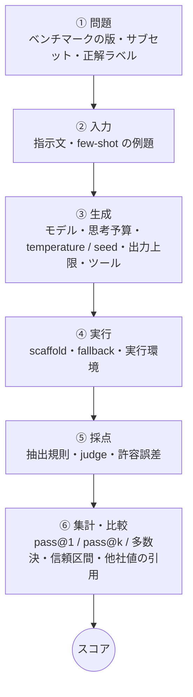

<!--
  このファイルは benchlab/article/template.md から build.py が生成します。直接編集しないこと。
  実験の数字はすべて実測ログから埋めています。公開データの数字は出典つき（benchlab/public/public_observations.csv）。
-->

## はじめに

Sun* の魯です。データサイエンティストとして分析・モデリングの仕事を5〜6年やってきて、ここ最近は AI / LLM を組み込んだシステムの設計・実装を担当しています。

新しいモデルが出るたびに、数十項目のスコア表が並びます。そして社内でも、お客様との打ち合わせでも、こう聞かれます。

**「こっちのモデル、ベンチマークで3pt高いですよね。こっちを選べばいいですか？」**

その 3pt は、本当にモデルの差なのか。気になったので、手元で測ってみました。6つの LLM に MMLU-Pro と GSM8K の問題を解かせ、**問題もモデルも変えずに、評価条件を意図的に変えながら**、点数がどう変わるかを数えています。生成は **3,634 回**です。

結果は、想像していたよりもずっと大きく動きました。

- **同じ出力を、別の公式の採点規則にかけただけで、正答率が最大 16.7pt 変わりました。** 原因の1つは、答えの前に付いた `$` 記号です。
- **同じモデル・同じ150問でも、設定上は seed だけを変えた実行の間に、最大 10.0pt の差が出ました。**
- **思考設定を上げた構成では、出力トークンが 15.7 倍になり、正答率が -13.3pt 動いた条件もありました。**

:::message
**この記事は「どのモデルが一番強いか」を主張するものではありません。** 使ったのは 1.7B〜20B の open-weight モデルで、フロンティアモデルとは能力の桁が違います。測っているのは、**同じモデル・同じ問題で評価条件を変えたときに、数字がどれだけ動くか**です。推論はすべて自分で用意した環境（ollama、主に AWS の GPU インスタンス1台）で行い、外部の LLM API は使っていません。
:::

先に、本稿全体の主張を1文で書いておきます。

> **ベンチマークの点数は、モデルから直接出てくる数字ではない。問題・入力・生成・実行・採点・集計を通った、最後の出力である。**

---

## 1. 先に結論：実測で分かった4つのこと

### ① 採点規則だけで、同じ出力の点数が最大 16.7pt 変わる

同じ回答に、実在する評価ツールの公式の採点規則を当て直しただけで、GSM8K では最大 16.7pt、MMLU-Pro では最大 8.0pt 動きました。大きく動いたのは回答形式を守れない小型モデルで、gpt-oss 20B は両方とも 0.0pt です。今回の6モデルは互いの差が大きく、順位は入れ替わりませんでした（15対中 0 対）。

### ② 途中で打ち切られた回答も、「採点」されている

出力上限 4,096 トークンで、Qwen3 4B の 33%、Granite 4.2 3B の 31% の回答が推論の途中で切れていました。それでも公式の抽出規則は、切れた文章の最後に現れた大文字1文字を「答え」として拾っていました。

### ③ 例題を見せる（5-shot）と、3モデルとも点が下がった

MMLU-Pro 公式の既定である 5-shot にすると、正答率は -3.3pt / -10.0pt / -6.7pt 動きました。形式どおりに答える割合は上がっています。問題単位では、LFM2.5 8B で 28 問が正解から不正解に、13 問がその逆に変わりました。

### ④ 思考設定を変えても、実行を繰り返しても、点数は動く

gpt-oss 20B の high 構成では、出力上限 16,384 で 15% の問題から答えが出ず、正答率は low と比べて -13.3pt でした。出力上限を 65,536 に広げても正答率は 90.0% で low の 98.3% には戻らず、6 問は上限まで考え続けて何も答えませんでした。そして設定上は seed だけを変えた実行の間でも、正答率には 4.7pt〜10.0pt の差が出て、**問題単位では 15%〜20% の正誤が入れ替わっていました。**

公開されているベンチマークでは、これにさらにツール・scaffold・fallback・比較相手の数字の出どころが加わります（第4〜5章）。

---

## 2. まず見てほしい：`$` 1文字で 16.7pt

Llama 3.2 3B に、GSM8K の問題を解かせた回答の最後の部分です（`gsm8k-test-485`、正解は 220）。

```text:Llama 3.2 3B の実際の出力（末尾）
…3 times that amount is 3 x $80 = $240.

Now, we know that the bag costs $20 less than $240. To find the cost of the bag, we need to subtract $20 from $240.

$240 - $20 = $220

So, the bag costs $220.

The answer is $220.
```

正解です。ところが、EleutherAI の lm-evaluation-harness（GSM8K `gsm8k-cot`）[8] の2つの採点規則は、この回答に別々の判定を出します。

| 採点規則（どちらも lm-eval 公式） | 何を探すか | この回答 |
|---|---|---|
| `strict-match` | `The answer is (\-?[0-9\.\,]+).` | ✗（`is` の直後が `$` なので一致しない） |
| `flexible-extract` | 数字らしい最後の文字列 | ✓（`220`） |

Llama 3.2 3B の60問のうち、`strict-match` では不正解・`flexible-extract` では正解になった回答は 10 問で、**10 問すべてが「The answer is $…」の形でした。** 正答率は 65.0% と 81.7%、差は 16.7pt です。Qwen3 1.7B の同じような 5 問のうち 4 問は、答えを Markdown の太字（`**8**`）で書いていました。

lm-eval は、この2つのスコアを**同じ生成結果に対して並べて出します**。ツール自身が「採点規則で数字が変わる」ことを前提にしているわけです。

もう1つ。Granite 4.2 3B が MMLU-Pro の選択肢問題を解いていた回答の最後です（`mmlupro-2954`、正解は F）。

```text:Granite 4.2 3B の実際の出力（末尾、4,096 トークンで打ち切り）
…larger n are more plausible.

Among the plausible ones, D (6 polygenes, 4 inches each), F (8 polygenes, 3 inches each), H (4 polygenes, 6 inches each), J (10 polygenes, 
```

推論の途中で、出力上限の 4,096 トークンに達して切れています。答えは書かれていません。それでも、MMLU-Pro 公式スクリプトの抽出規則は、この回答を **J を選んだ**と読みました。文章の中で最後に単独で現れた大文字が J だったからです。正解の F は、その直前に候補として書かれています。

**どちらも、モデルが何を考えたかとは関係なく、採点の手順が点数を決めています。** 以下、これが何問の単位で、どれくらい起きているかを見ていきます。

### 2.1 実験A：同じ出力に、公式の4つの規則を当てる

MMLU-Pro の公式リポジトリ [7] には、採点に関わるスクリプトが少なくとも3つあり、それぞれ規則が違います。

| スクリプト | 答えの抜き出し方 | 抜き出せなかったとき |
|---|---|---|
| `evaluate_from_api.py` | `answer is (X)` → `Answer: X` → 全文で最後に単独で現れる A〜J の1文字、の3段。各段で**最初の**一致 | その問題の**選択肢数の範囲で**ランダムに1つ選んで採点 |
| `compute_accuracy.py` | Level 1（`answer is (X)` のみ）と Level 2（上の3段）の**2つのスコアを並べて**出力 | 選択肢数に関係なく **A〜J の10文字から**ランダムに選ぶ |
| `evaluate_from_apiX.py`（2026-03 更新） | 同じ3つのパターンを順に試し、各パターンの**最後の**一致 | **不正解** |

`evaluate_from_api.py` の乱数推測は、1問処理するたびにそのカテゴリの結果ファイル全体を読み直し、それまでに抜き出せなかった問題すべてについて乱数を引き直します。推測で入った点数は、実行の経過によっても変わりえます。

6つのモデルに MMLU-Pro の150問を1回だけ解かせ、**その出力を一切変えずに**、この4つの規則を再現した採点器で採点し直しました（再現の詳細は付録）。

| モデル | evaluate_from_api.py | evaluate_from_apiX.py | compute_accuracy.py L2 | compute_accuracy.py L1 | 公式規則間の幅 |
|---|---|---|---|---|---|
| Qwen3 1.7B | 40.7% | 39.3% | 40.7% | 32.7% | **8.0pt** |
| Llama 3.2 3B | 43.3% | 42.0% | 42.7% | 42.7% | **1.3pt** |
| Granite 4.2 3B | 49.3% | 49.3% | 49.3% | 50.7% | **1.3pt** |
| Qwen3 4B | 62.0% | 61.3% | 62.0% | 61.3% | **0.7pt** |
| LFM2.5 8B | 58.0% | 59.3% | 58.0% | 56.7% | **2.7pt** |
| gpt-oss 20B | 71.3% | 71.3% | 71.3% | 71.3% | **0.0pt** |


Qwen3 1.7B の正答率は 8.0pt 動きました（`evaluate_from_api.py` で 40.7%、`compute_accuracy.py` の Level 1 で 32.7%）。ほかのモデルの幅は 2.7pt 以下で、形式をきちんと守る gpt-oss 20B は 0.0pt です。MMLU-Pro の README [7] も「We found that different answer extraction mechanisms have **minor impact** on the results.」と書いていて、形式を守れるモデルについてはこの記述と一致します。**差が大きく出たのは、指定した形式で答えない出力が多い小型モデルです。**

GSM8K も同じ構図です。

| モデル | lm-eval strict-match | lm-eval flexible-extract | lm-eval の2規則の差 |
|---|---|---|---|
| Qwen3 1.7B | 63.3% | 70.0% | **6.7pt** |
| Llama 3.2 3B | 65.0% | 81.7% | **16.7pt** |
| Granite 4.2 3B | 88.3% | 88.3% | **0.0pt** |
| Qwen3 4B | 96.7% | 96.7% | **0.0pt** |
| LFM2.5 8B | 90.0% | 95.0% | **5.0pt** |
| gpt-oss 20B | 98.3% | 98.3% | **0.0pt** |

今回の6モデルは互いの正答率が離れていて、採点規則による上下では追い越しは起きませんでした。15のモデル対のうち順位が入れ替わったのは、MMLU-Pro の4つの規則のどの2つを比べても 0 対、GSM8K の lm-eval の2規則でも 0 対です。この効果量を、フロンティアモデルにそのまま当てはめることはできません。

### 2.2 なぜ動いたのか：答えはどの規則で抜き出されたか

| モデル | ① answer is (X) | ② Answer: X | ③ 最後の1文字 | ③で拾われて正解 | 抽出失敗 | 推測の期待寄与 | 今回の推測で実際に正解 |
|---|---|---|---|---|---|---|---|
| Qwen3 1.7B | 120 | 0 | 29 | 14 | 1 | +0.07pt | 1問（+0.67pt） |
| Llama 3.2 3B | 137 | 0 | 6 | 0 | 7 | +0.47pt | 2問（+1.33pt） |
| Granite 4.2 3B | 121 | 0 | 28 | 1 | 1 | +0.07pt | 0問（+0.00pt） |
| Qwen3 4B | 130 | 0 | 20 | 1 | 0 | +0.00pt | 0問（+0.00pt） |
| LFM2.5 8B | 126 | 1 | 22 | 4 | 1 | +0.07pt | 0問（+0.00pt） |
| gpt-oss 20B | 150 | 0 | 0 | 0 | 0 | +0.00pt | 0問（+0.00pt） |


Qwen3 1.7B は150問中 29 問（19%）で「The answer is (X)」とも「Answer: X」とも書かず、3段目の「最後の1文字」で拾われていました。そのうち 14 問が正解扱いです。`compute_accuracy.py` の Level 1 は3段目を使わないので、この分が消えます。2.1節の 8.0pt は、ほぼこれで説明できます。

抜き出せなかった回答への乱数推測は、期待値では小さな寄与です。最も多い Llama 3.2 3B（抽出失敗 7 問）でも期待寄与は +0.47pt でした。**期待寄与は小さい一方、少数の抽出失敗でも実現値は数問ぶれます。今回の Llama 3.2 3B では、期待寄与 +0.47pt に対して実際には 2 問が正解となり、+1.33pt 加算されました。**

### 2.3 打ち切られた回答も「採点」されている

| モデル | 出力上限で打ち切り | 抽出失敗 | 打ち切られた回答のうち抽出失敗 |
|---|---|---|---|
| Qwen3 1.7B | 0.7% | 0.7% | 100.0% |
| Llama 3.2 3B | 8.7% | 4.7% | 53.8% |
| Granite 4.2 3B | 31.3% | 0.7% | 2.1% |
| Qwen3 4B | 33.3% | 0.0% | 0.0% |
| LFM2.5 8B | 23.3% | 0.7% | 2.9% |
| gpt-oss 20B | 0.0% | 0.0% | —（打ち切りなし） |

出力上限 4,096 トークンで、Qwen3 4B の 33%、Granite 4.2 3B の 31%、LFM2.5 8B の 23% の回答が切れていました。それなのに抽出失敗はほとんどありません（打ち切られた回答のうち抽出失敗は Qwen3 4B で 0%、Granite 4.2 3B で 2%）。冒頭の Granite の例と同じく、**切れた推論の文章から大文字1文字が拾われていた**からです。Granite 4.2 3B で3段目に拾われた 28 問のうち、正解は 1 問でした。

打ち切られた回答だけを、出力上限 16,384 で生成し直しました。ほかの条件はすべて同じです。

| モデル | 4,096 で打ち切り | 16,384 でも打ち切り | その問題の正答率 4,096 → 16,384 | 150問全体 4,096 → 差し替え後 |
|---|---|---|---|---|
| Qwen3 1.7B | 1 | 0 | 100.0% → 0.0% | 40.7% → 40.0%（-0.7pt） |
| Llama 3.2 3B | 13 | 5 | 15.4% → 7.7% | 43.3% → 42.7%（-0.7pt） |
| Granite 4.2 3B | 47 | 9 | 21.3% → 48.9% | 49.3% → 58.0%（+8.7pt） |
| Qwen3 4B | 50 | 0 | 26.0% → 38.0% | 62.0% → 66.0%（+4.0pt） |
| LFM2.5 8B | 35 | 12 | 25.7% → 37.1% | 58.0% → 60.7%（+2.7pt） |

打ち切られていた問題だけで見ると、Granite 4.2 3B の正答率は 21.3% から 48.9% に上がりました。4,096 のときは、モデルが最終回答を書き終える前に、推論途中に現れた選択肢文字が回答として採点されていた問題が多くありました。16,384 の上限で再実行したこの run では、最後まで解答に到達したものが増えました。150問全体では 49.3% → 58.0%（+8.7pt）で、LFM2.5 8B との差は 8.7pt から 2.7pt に縮みました（順位は変わっていません）。

一方で、上限を広げても点が上がらないモデルもありました。Llama 3.2 3B は、打ち切られていた 13 問のうち 5 問が 16,384 でも終わらず、その問題の正答率は 15.4% → 7.7% でした。なお、ここでの再生成は続きからではなく新たな生成なので、打ち切られる前の部分も同じ文章になるとは限りません。

出力の上限は、公式ツールでも一定ではありません。本稿の上限は旧来の `evaluate_from_api.py` の設定（4000）に近い値ですが、現行の `evaluate_from_apiX.py` の `--max_tokens` の既定値は **32,768** で、上限に達した問題だけを再実行する `--rerun-maxtoken` まで用意されています。**出力上限も、脚注に書かれるべき条件です。**

---

## 3. スコアはパイプラインの最後の出力である

第2章で起きたことを整理すると、ベンチマークの点数は、次のパイプラインの最後に出てくる数字です。



**どの層も、点数を動かしうる変数です。** 本稿の実験と、第4〜5章で読む公開データは、それぞれこの層に対応しています。

| 層 | 本稿の実験 | 公開データの例 |
|---|---|---|
| ① 問題 | — | MMLU-Pro の正解ラベル修正、HLE 系列の複数版・派生（4.1） |
| ② 入力 | 実験B：0-shot → 5-shot（6.1） | MMLU-Pro リーダーボードの 5-shot / 0-shot 混在（4.2） |
| ③ 生成 | 実験C：思考予算（6.2）、実験D：seed（6.3）、出力上限（2.3） | 各社の effort の違い（4.3）、ツール（4.5） |
| ④ 実行 | — | SWE-Marathon の scaffold（5.3）、fallback（5.4） |
| ⑤ 採点 | 実験A：公式の4つの採点規則（2.1） | HLE の judge の交代（5.1） |
| ⑥ 集計・比較 | 2モデル差の区間（7章） | DeepSeek-R1 の pass@1 と cons@64（4.4）、他社値の引用（5.2） |

第2章で見たのは、このパイプラインのうち⑤「採点」だけを動かしても、同じ出力の点数が変わるという例でした。以下では、残りの層について公開データと手元の実験から見ていきます。

---

## 4. 公開データの脚注（1）：問題・入力・生成

ここからは、論文・公式リポジトリ・公式発表の原文を、パイプラインの層ごとに読んでいきます。引用した数値は、出典 URL と原文つきで `public_observations.csv` にまとめてあります（70 行）。

### 4.1 ① 問題：同じ名前でも、中身は版によって違う

MMLU-Pro の公式データセットページ [1] の更新履歴には、こういう記述が並んでいます。

- **2024-07-08**：「We have corrected the answer for the question with ID 6392 from D to B.」
- **2025-04-06**：「We corrected 15 answers in medical domain based on the recommendations of medical professionals」
- **2026-01-18**：「Fixed leading space issue in answer options ... This formatting inconsistency **could have been exploited as a shortcut**.」

最後の項目は、選択肢の先頭のスペースという表面的な書式の違いが、正解の手がかりとして使えてしまう状態だったという報告です。同じページには「**There are mistakes in the dataset.**」とはっきり書かれています。MMLU を再アノテーションした Gema et al. [2] は「**We estimate that 6.49% of MMLU questions contain errors**」と推定し、Virology 分野では分析対象の **57%** に誤りがあったと報告しています。

Humanity's Last Exam（HLE）は、「現行のフロンティアモデルが解けないこと」を条件に作られた 2,500問の試験です [9]。そして同じ Scale Labs のページには、旧版の **HLE-preview**、2,500問に確定した **HLE**、2026-09-17 に公開された **HLE-Rolling**（「replaced some easy questions with harder questions from our held out set」）が並んでいます。さらに、この記事を書いている週の 2026-09-22 には、HLE を1年かけて精査した **1,000問の HLE-Diamond** も公開されました [12]。**同じ「HLE」の名前でも、元の HLE、HLE-Rolling、HLE-Diamond は別の問題集合です。** スコア表に「HLE」とだけあったら、どの版かを確認する必要があります。

### 4.2 ② 入力：5-shot と 0-shot が、同じ表に混ざっている

MMLU-Pro の公式ページ [1] には、リーダーボードについてこうあります。

> Some of the results are run by us while some of the results are obtained by others. **Normally we use 5-shot, some models like Gemini use 0-shot.**

1つのリーダーボードの中に、5-shot と 0-shot、自分たちで測った数字と他人が測った数字が混ざっています。この差が同じモデルでどれくらいになるかを測ったのが、6.1節の実験B です。

### 4.3 ③ 生成：思考予算

思考予算は、積めば必ず上がるわけではありません。Claude Opus 5.5 の発表ページ [6] は、表の値を「adaptive thinking at max effort」で出したうえで、本文でデフォルトの medium effort の値にも触れています。

| ベンチマーク | medium effort（本文） | max effort（表） |
|---|---|---|
| FrontierCode v1.1 | **54.6%** | 54.4% |
| CursorBench 4.0 | 52.5% | **57.8%** |

そして、発表ページ同士では effort が揃っていません。Opus 5.5 のページの Terminal-Bench 4.0 は「Claude Opus 5.5 at **xhigh** effort and GPT-6 Astra at **high** effort ... these represent each model's highest score」で、GPT-6 Sol のページの AutomationBench は、GPT-6 Astra を **low** effort で載せています（5.2節）。**並べ方は、ページごと・項目ごとに違います。**

### 4.4 ⑥ 集計：pass@1 か、多数決か

DeepSeek-R1 の論文 [4] の Table 2 は、AIME 2024 を2つの集計方法で並べています。

| モデル | pass@1 | cons@64（64回の多数決） |
|---|---|---|
| OpenAI-o1-mini | 63.6 | 80.0 |
| OpenAI-o1-0912 | **74.4** | 83.3 |
| DeepSeek-R1-Zero | 71.0 | **86.7** |

**pass@1 では o1-0912 が上、cons@64 では R1-Zero が上。集計方法を変えただけで、順位が入れ替わっています。** 論文自体はどちらも明記していて、何も隠していません。同じ論文は「pass@1」も「temperature 0.6、top-p 0.95 で1問あたり4〜64回生成した正答率の平均」と定義しています。

正解かどうかを判定する外部の仕組み（テストや検証器）がない場面では、oracle としての pass@k はそのまま再現できません。一方、ユニットテストや検証器があるタスクなら k 個の候補から選べますし、多数決や self-consistency は実運用でも使えます。**どの集計方法の数字かを見れば、自分の環境で再現できる数字かどうかが分かります。**

### 4.5 ③ 生成：ツール

Claude Fable 5.1 の HLE を調べると、2つの数字が出てきます。

| 出典 | スコア | 条件の記述 |
|---|---|---|
| Scale Labs のリーダーボード（2026-09-17 更新）[9] | **46.50%** ±2.00 | effort は xhigh。温度 0.0、最終回答と確信度を答えさせ、o3-mini が採点。ツールの記載なし |
| Anthropic の Claude Opus 5.5 発表ページに掲載された Fable 5.1 [6] | **65.6%** | 「with tools」 |

同じモデル、同じ名前の試験で 19.1pt 違います。ただし、**この 19.1pt をツールの効果と読むことはできません。** 2つの数字は、ツールの有無だけでなく、プロンプトも、実行環境も、採点の手順も、同じである保証がないからです。言えるのは、**同じ条件で測られていないので、そのまま比べられない**ということだけです。

では、同じ問題集合・同じ reasoning 設定で、without tools / with tools を並べた評価ではどうでしょうか。HLE-Diamond の公式ページ [12] は、「All models are evaluated with reasoning high」としたうえで、ツールなしとツールあり（web+code）の2列を並べています。

| モデル | Without tools | With tools (web+code) |
|---|---|---|
| GPT-6 Astra | 60.6% | 82.9% |
| Claude Fable 5.1 | 51.3% | 72.4% |
| Gemini 3.8 Flash | **34.3%** | 60.3% |
| GPT-6 Sol | 33.8% | **64.9%** |

HLE-Diamond の同一ページでは、reasoning high の条件で、with tools (web+code) のスコアは without tools より約20〜30pt 高く報告されています。**Gemini 3.8 Flash と GPT-6 Sol の順位も入れ替わっています。** ツール条件が違う2つの数字は、同じ表に並んでいても、同じ評価条件の数字ではありません。

---

## 5. 公開データの脚注（2）：実行・採点・比較

### 5.1 ⑤ 採点：judge は途中で替わっている

HLE の自由記述は、別の LLM（judge）が参照解答と照らして採点します。公式リポジトリの採点スクリプト [3] には、judge のデフォルト値がこう書かれています。

```python
parser.add_argument("--judge", type=str, default="o3-mini-2025-01-31", help="Judge model") # prev: "gpt-4o-2024-08-06"
```

**公式の judge は、途中で gpt-4o から o3-mini に替わっています。** そして judge への採点基準は、数値問題について「**within a small margin of error for numerical problems**」なら正解です。その「small」が何%かは、judge のモデルの判断に委ねられています。6.2節の実演は、この境目の例です。

### 5.2 ⑥ 比較：その数字は、誰がどう測ったものか

2026-09-22、Anthropic が Claude Opus 5.5 を、OpenAI が GPT-6 Sol と Luna を発表しました。**両社の発表ページに、同じ AutomationBench の数字があります。**

| モデル | Anthropic のページ [6] | OpenAI のページ [10] |
|---|---|---|
| GPT-6 Astra | **41.4%**（Zapier 公開リーダーボードの値、effort の記載なし） | **30.3%**（low effort） |
| Claude Fable 5.1 | 31.4% | 31.4%（「w/ Opus 5 Fallback」、max） |

GPT-6 Astra は、どちらのページを読むかで 41.4% にも 30.3% にもなります。ただし、この 11.1pt も effort の差とは読めません。effort だけでなく、測った主体（Zapier の公開リーダーボードと OpenAI）も違うからです。

ここで大事なのは、**脚注は「なぜ 11pt 違うか」を教えてくれるとは限らない**ということです。むしろ脚注が教えてくれるのは、「**この 11pt を、そのまま比べてはいけない**」ということです。

OpenAI のページの末尾には、こういう注記もあります。

> Evaluations of competitor models were taken from publicly available reports. **Scores for Claude Fable 5 were reported when scores for Claude Fable 5.1 were unavailable.**

比較表の「Fable」の列には、Fable 5.1 の数字が無い項目では前の版の Fable 5 の数字が入っています。**比べている相手のモデルの版まで、項目ごとに入れ替わりうる**わけです。さらに「Evaluations of GPT were performed in our research environment or via our API, which may provide slightly different output from production ChatGPT」ともあり、発表の数字は、私たちが ChatGPT で使うときと同じ条件ですらありません。

### 5.3 ④ 実行：測定の単位は「モデル × 枠組み」

超長時間のエージェントタスクを集めた SWE-Marathon [5] は、1試行あたりのトークン消費（中央値）をこう報告しています。

| モデル | 枠組み | トークン中央値 |
|---|---|---|
| GPT-5.5 | Terminus 2 | 0.40M |
| GPT-5.5 | Codex | 4.8M |
| Claude Opus 4.7 | Terminus 2 | 4.4M |
| Claude Opus 4.7 | Claude Code | 21.9M |

> Holding the model fixed, median tokens per trial varies by up to 12×. ... **Token use is therefore the (model, scaffold) cell, not the model.**

本稿の主張と、ほぼ同じ文です。

### 5.4 ④ 実行：fallback——測っているのは「モデル」ですらない

Opus 5.5 のページ [6] の注記です。

> Claude Opus 5.5 was evaluated with its production safeguards enabled. When they intervened, cybersecurity tasks were completed by **Claude Opus 4.8**, and biology and frontier LLM development tasks were completed by **Claude Opus 5**.

**「Opus 5.5 のスコア」の一部は、別のモデルが解いた問題を含んでいます。** 測定の単位は、安全機構と fallback を含むシステムです。

OpenAI のページも、Fable 5.1 の AutomationBench について「it omits the cost of the Opus 5 fallbacks, which occurred on **~40% of tasks**」と書いています。一方、Anthropic のページの AutomationBench の脚注は「These runs were performed **without fallback models**」です。2つのページを読むだけでは、どちらの記述が Fable 5.1 の 31.4% に当てはまるのかは判断できません。確実に言えるのは、**同じ数字に付く「どのシステムを測ったのか」の説明が一致していない**ということです。

念のため書いておくと、これはどちらかの会社への批判ではありません。Opus 5.5 のページは標準誤差まで明記していますし、GPT-6 Sol のページは競合の数字の出典と代用ルールを書いています。**脚注を丁寧に書いているからこそ、こうした違いが読み取れる**のです。

---

## 6. 手元で確かめる：入力・生成・乱数

第4〜5章の層のうち、手元で評価条件を比較できるものについて、条件をできるだけ揃えて測りました。ツール・scaffold・fallback・judge は、公開データのほうが強い証拠なので実験していません。

### 6.1 実験B（② 入力）：0-shot を 5-shot に替える

実験A と同じ150問を、MMLU-Pro 公式の CoT 例題5問（同じカテゴリの validation の先頭5問）つきで、3つのモデルに解かせました。450件すべてで、例題が5問入っていることを確認しています。例題を見せると生成全体が変わるので、「何点が形式の改善で、何点が能力の変化か」は厳密には分けられません。ここでは正答率と、指定どおりの形式で答えた割合を並べて見ます。

| モデル | 0-shot | 5-shot | 差 [item-bootstrap 95% CI] | 形式どおり 0→5-shot | 抽出失敗 0→5-shot | 平均入力トークン |
|---|---|---|---|---|---|---|
| Qwen3 1.7B | 40.7% | 37.3% | -3.3pt [-11.3, +4.7] | 80.0% → 99.3% | 0.7% → 0.7% | 258 → 1,424 |
| LFM2.5 8B | 58.0% | 48.0% | -10.0pt [-18.0, -2.0] | 84.0% → 91.3% | 0.7% → 0.0% | 244 → 1,388 |
| gpt-oss 20B | 71.3% | 64.7% | -6.7pt [-12.7, -0.7] | 100.0% → 100.0% | 0.0% → 0.0% | 299 → 1,432 |

表の区間は、問題の抜き出し方に対する不確かさ（問題単位の bootstrap）です。**生成をやり直したときの揺れ（6.3節）は含みません。**

| モデル | 正解 → 不正解 | 不正解 → 正解 |
|---|---|---|
| Qwen3 1.7B | 21 問 | 16 問 |
| LFM2.5 8B | 28 問 | 13 問 |
| gpt-oss 20B | 16 問 | 6 問 |

3つのモデルとも、5-shot のほうが正答率が低くなりました。形式どおりに答えた割合は Qwen3 1.7B で 80% → 99%、LFM2.5 8B で 84% → 91% と上がっています。gpt-oss 20B はもともと 100% 形式どおりで、それでも -6.7pt 動きました。**形式が揃ったことでは、この変化は説明できません。** 打ち切りの影響を除くため、両方の条件で打ち切られなかった問題だけで比べても、-2.7pt / -15.5pt / -6.7pt でした。

なぜ下がったのかは、この実験からは特定できません。確実に言えるのは、**同じモデル・同じ問題でも、0-shot と 5-shot の数字は -3.3pt〜-10.0pt 違い、「例題を見せれば上がる」とも限らない**ということです。4.2節のように両者が1つの表に混ざっていると、その差がどちら向きなのかさえ、表からは読めません。

### 6.2 実験C（③ 生成）：思考設定を変える

まず、**「thinking OFF」という条件そのものが、モデルによって違います。**

| モデル | `think:false` を渡したときに起きたこと |
|---|---|
| Llama 3.2 3B | thinking 機能自体がない（`think:true` はエラー） |
| Qwen3 1.7B / Granite 4.2 3B / Qwen3 4B | 思考欄は空になる |
| LFM2.5 8B | **本文に `<think>` タグを書き始める**（基線の全回答で） |
| gpt-oss 20B | **OFF にできない**（最小は `low`） |

そこで、**各モデルの中だけで**、そのモデル自身が定める reasoning 設定を変えたときの結果を見ました（GSM8K 60問）。

なお、OFF / low の基線では最大出力 4,096、ON / medium / high では 16,384 を設定しています。そのため、ここで観測した差を reasoning 設定単独の因果効果とは解釈しません。**reasoning 設定と、それに伴う生成予算を含む構成差**として比較します。ただし、Qwen3 1.7B と gpt-oss 20B の基線では、出力が 4,096 に一度も届いていません（最長 624 / 405 トークン）。この2モデルについては、上限の違いは基線の結果を左右していません。基線でも上限に達した回答があった Granite 4.2 3B（5 問）と LFM2.5 8B（2 問）は、構成差として読む必要があります。

| モデル | 設定 | 正答率 | 差 [item-bootstrap 95% CI] | 平均出力トークン | 倍率 | 時間 p50 / p90 | 打ち切り |
|---|---|---|---|---|---|---|---|
| Qwen3 1.7B | OFF | 78.3% | — | 224 | ×1.0 | 1.9s / 3.2s | 0.0% |
| Qwen3 1.7B | ON | 85.0% | +6.7pt [-3.3, +16.7] | 1,582 | ×7.1 | 7.1s / 42.2s | 1.7% |
| Granite 4.2 3B | OFF | 88.3% | — | 958 | ×1.0 | 3.0s / 28.9s | 8.3% |
| Granite 4.2 3B | ON | 86.7% | -1.7pt [-10.0, +6.7] | 3,160 | ×3.3 | 9.3s / 120.0s | 10.0% |
| LFM2.5 8B | OFF | 95.0% | — | 776 | ×1.0 | 4.1s / 14.7s | 3.3% |
| LFM2.5 8B | ON | 93.3% | -1.7pt [-5.0, +0.0] | 916 | ×1.2 | 4.5s / 18.2s | 0.0% |
| gpt-oss 20B | low | 98.3% | — | 196 | ×1.0 | 2.2s / 3.8s | 0.0% |
| gpt-oss 20B | medium | 98.3% | +0.0pt [-5.0, +5.0] | 385 | ×2.0 | 3.5s / 7.4s | 0.0% |
| gpt-oss 20B | high | 85.0% | -13.3pt [-21.7, -5.0] | 3,083 | ×15.7 | 5.6s / 192.5s | 15.0% |

区間の意味は 6.1節と同じで、生成をやり直したときの揺れは含みません。時間は共有 GPU 上の参考値で、effort 間の厳密な速度比較には使いません（付録 A.7）。


- Qwen3 1.7B は、出力が 7.1 倍になって +6.7pt（区間は 0 を含みます）
- Granite 4.2 3B は 3.3 倍で -1.7pt、LFM2.5 8B は 1.2 倍で -1.7pt
- gpt-oss 20B は、medium で 2.0 倍・+0.0pt、**high で 15.7 倍・-13.3pt**

gpt-oss 20B の high では、15% の問題で、**思考だけで出力上限の 16,384 トークンを使い切り、答えを1文字も出していませんでした。** OpenAI の gpt-oss 公式評価コードは、reasoning モデルの評価で `max_tokens=131_072` を使っています [11]。そこで、上限だけを 65,536 に広げて、同じ60問を解かせ直しました。

| 出力上限 | 正答率 | 上限に達して打ち切り | 平均出力トークン | 最大出力トークン | 時間 p50 / p90 |
|---|---|---|---|---|---|
| 16,384 | 85.0% | 9 / 60 | 3,083 | 16,384 | 5.7s / 193.1s |
| 65,536 | 90.0% | 6 / 60 | 7,908 | 65,536 | 11.9s / 835.2s |

上限を4倍にすると、正答率は 85.0% から 90.0% に戻りましたが、low の 98.3% には届きませんでした。16,384 で答えが出なかった 9 問のうち、65,536 で答えにたどり着いたのは 3 問だけです。**残りの 6 問は、65,536 トークンまで考え続けて、やはり何も答えませんでした。** 所要時間の p90 は 14分 です。

少なくともこの run では、16,384 という上限だけでは、観測された差を説明しきれませんでした。**答えに収束しないまま考え続ける問題が生まれていて、上限をどこに置くかで、その問題が「不正解」として数えられるか「時間切れ」として数えられるかが決まります。** 公式評価の 131,072 まで広げたら答えが出たのかどうかは、本稿では確かめていません。

**思考予算と出力上限は、組で脚注に書かれるべき条件です。** 片方だけを書いた数字は、何を測ったのか分かりません。

具体例を1つ。`gpt-oss:20b` に同じ問題を effort だけ変えて、各3回解かせました（temperature 0、出力上限 16,384）。

```
A train travels 47 km in 35 min. At the same speed, how far in 2h?
Answer with just the number in km.
```

正解は 47 ÷ 35 × 120 = **161.142857…** km です。

| effort | 3回の回答 | 出力トークン | 数値の完全一致で採点 | ±1% まで許容（仮の規則） |
|---|---|---|---|---|
| low | `161.2` / `161.14` / `161.14` | 63 / 63 / 63 | ✗ ✗ ✗ | ✓ ✓ ✓ |
| medium | `161.14285714285714 km` / `161.14285714285714` / `161.14285714285714` | 1,082 / 1,125 / 1,125 | ✓ ✓ ✓ | ✓ ✓ ✓ |
| high | `（空）` / `161.14285714285714` / `161.14285714285714` | 16,384 / 7,874 / 7,874 | ✗ ✓ ✓ | ✗ ✓ ✓ |

low は丸めた値を答え、**完全一致なら3回とも不正解、±1% まで許容すれば3回とも正解**です。high は3回中2回、7,874 トークンかけて正確な値を出しましたが、**1回は上限まで考え続けて何も答えませんでした。** 「high に意味があったか」の答えは、採点の許容誤差でも、出力上限でも変わります。±1% は説明のための仮の規則で、GSM8K の規則でも、HLE の「small margin」の再現でもありません。low の3回の回答が `161.2` / `161.14` / `161.14` だったように、temperature 0 でも同じ設定の3回が揃うとは限りませんでした。

### 6.3 実験D（③ 生成）：seed だけを替える

**設定上は seed だけを変えて、同じ150問を3回解かせました**（temperature 0.7、seed 1 / 2 / 3）。比べるのは seed 同士だけです。

| モデル | seed 1 | seed 2 | seed 3 | 正答率の幅 | 逐題の不一致（平均 / 最大） |
|---|---|---|---|---|---|
| Qwen3 1.7B | 39.3% | 43.3% | 36.7% | 6.7pt | 16% / 17% |
| LFM2.5 8B | 51.3% | 61.3% | 54.0% | 10.0pt | 20% / 21% |
| gpt-oss 20B | 63.3% | 67.3% | 68.0% | 4.7pt | 15% / 15% |


3回の実行の間で、正答率には 4.7pt〜10.0pt の差が出ました。LFM2.5 8B の 10.0pt は、6.1節の 5-shot の効果と同じくらいの大きさです。

ただし、本稿の Ollama 0.34.0 の環境では、同じ seed をもう一度回したときも、出力が一字一句同じだったのは 48 / 60 でした。そのため、4.7pt〜10.0pt の差のすべてを seed 自体の効果とはみなしません。**seed の違いと、実行ごとの揺れ（run-to-run variation）を、この実験では分離できていません。**

そして、**総合点の揺れより、問題単位の揺れのほうがずっと大きい。** gpt-oss 20B の正答率の幅は 4.7pt でしたが、2つの seed の間で正誤が入れ替わった問題は平均 15% ありました。正解が不正解に変わった問題と、その逆の問題が、総合点の上ではほぼ打ち消し合っています。**点数が近いことと、同じ問題を解けていることは、別のことです。**

---

## 7. その差は、誤差ではないのか

### 7.1 1つの正答率の揺らぎ

ベンチマークの問題を、ある目標の問題分布からの標本とみなすと、正答率には「どの問題が選ばれたか」による揺らぎがあります。二項分布で近似すると、95% 区間の半幅はおよそ $1.96\sqrt{p(1-p)/n}$ で、正答率 50% なら 150問で ±8.0pt、2,500問で ±2.0pt です。Scale Labs の HLE リーダーボードの「54.80±1.94」は、2,500問でこの式を計算した値（±1.95pt）とほぼ一致します。

:::message
ここでの区間は、問題を目標タスクの分布からの標本とみなしたときの推定の不確かさです。**固定された問題集合そのものの得点が確率的に揺らぐ、という意味ではありません。**
:::

### 7.2 2つのモデルの差は、別の計算が要る

2つのモデルを同じ問題で比べるとき、上の区間を2つ並べて「重なっているから区別できない」と判断するのは正しくありません。差の不確かさは、問題ごとの正誤の組を再標本化する paired bootstrap で評価します。


本稿の6モデル・15対では、150問での差の 95% 区間の半幅は 7.3pt〜9.3pt（中央値 8.7pt）で、paired bootstrap の 95% 区間が 0 を含まなかったのは15対中 11 対でした。区間が 0 を含んだ 4 対の差は 2.7〜8.7pt です。今回は paired にしても区間はあまり狭くなりませんでした。モデル同士で正誤が食い違った問題が、150問中 33〜58 問あったからです。

### 7.3 発表ページの 1〜2pt 差

- GPT-6 Sol のページ：OSWorld 2.0 で「a similar score to Claude Opus 5 at medium effort—**60.5% versus 60.3%**」
- Opus 5.5 のページ：FrontierCode で 54.6%（medium）が「beating GPT-6 Astra's top score (**53.3%**)」

前者はページ自身が差を主張していません。後者は 1.3pt 差を「beating」と表現しています。同じ Opus 5.5 のページは Terminal-Bench 4.0 について「The standard error is **±2.6 pts**」と書いていますが、これを FrontierCode に当てはめることはできません。言えるのは、**ベンチマーク自身の不確かさが示されない限り、1〜2pt の差は大きさだけでは判断できない**ということです。標準誤差を明記した Opus 5.5 のページは、その意味で良い書き方の例です。

---

## 8. 実務：スコア表を6つの層で読む

### 8.1 スコア表を見たら、層ごとに確認する

| 層 | 確認すること | 本稿 |
|---|---|---|
| ① 問題 | ベンチマークのどの版か。公式の全体か、サブセットか | 4.1 |
| ② 入力 | few-shot / zero-shot。例題は何問か | 4.2、6.1 |
| ③ 生成 | thinking の ON / OFF と effort（「OFF」が何を止めているか）。**出力上限**。temperature・seed。ツールの有無 | 2.3、4.3、4.5、6.2、6.3 |
| ④ 実行 | scaffold・試行回数。fallback や安全機構の介入。どこで動かしたか | 5.3、5.4、付録 |
| ⑤ 採点 | 採点スクリプトとその版。抜き出せなかった回答の扱い。judge のモデルとプロンプト | 2.1、5.1 |
| ⑥ 集計・比較 | pass@1 / pass@k / 多数決。信頼区間。他社の数字は自社実測か引用か、相手の版は同じか | 4.4、5.2、7 |

そして、差を読むときは**標準誤差か信頼区間を探してください**。**単純な正答率であれば**、書かれていなくても問題数から 7.1節の式でおおよその幅を見積もれます。

ベンダー自身も、差の読み方に注意を促しています。Opus 5.5 の発表ページ [6] の冒頭にはこうあります。

> at these levels of capability we've found that **benchmark margins have become a less reliable guide to real-world differences**. In our own use, the gap between Opus 5.5 and Claude Fable 5.1 is narrower than these scores suggest.

### 8.2 自社の評価セットを持ち、条件ごと記録する

最後に一番効くのは、**自社の用途に近い、小さな評価セットを自前で持つこと**です。本稿の実験では、**採点規則を替えるだけで最大 16.7pt、5-shot にするだけで最大 -10.0pt 動き、seed 違いの実行の間でも最大 10.0pt の差が出ました。** だから、**問題数を増やす前に、まず評価系を固定する。** 条件が揃っていない2つの数字の差は、問題数をいくら増やしても解釈できないからです。

スコアと一緒に、次の「評価条件カード」を残しておくと、後から比べられなくなる事故を防げます。本稿の実験の数字も、このカードの各欄を埋めた状態で出しています。

```yaml:eval_card.yaml
# ① 問題
benchmark: mmlu-pro-mini150        # 公式の全体ではなく独自サブセット
benchmark_revision: b189ec765aa7   # 取得元データセットの commit
items_sha256: 8455871d…
dataset_sample_seed: 20260924      # 問題を抜き出した乱数
# ② 入力
prompt_template: mmlupro_api_zeroshot_variant
prompt_sha256: …
few_shot: 0
# ③ 生成
model: qwen3:4b
model_digest: 359d7dd4bcda
thinking: false                    # 実際に思考が出たかは run ごとに記録
reasoning_effort: null
temperature: 0.0
generation_seed: 0                 # 生成時の乱数（問題の抜き出しとは別）
max_output_tokens: 4096            # 打ち切られた回答の割合も記録する
tools: []
# ④ 実行
scaffold: single_turn_cot
fallback: none
runtime: ollama 0.34.0
hardware: NVIDIA L40S (AWS g6e.2xlarge)
# ⑤ 採点
grader: mmlupro_evaluate_from_api  # 抽出規則と、抽出失敗時の扱い
grader_revision: f418b116db00       # MMLU-Pro リポジトリの commit
lm_eval_revision: d6de81643928     # GSM8K の採点（strict-match / flexible-extract）
judge: null
# ⑥ 集計
n_samples: 1
aggregation: pass@1
```

---

## 9. この記事の限界

- **公開データの数字の差は、因果として読めない。** 46.5% と 65.6%、41.4% と 30.3% のように、別々の評価から来た数字の差を、どれか1つの条件の効果とは解釈できません。本稿が言っているのは「そのまま比べられない」ことまでです。2つのページの記述が食い違って見える場合（5.4節）も、どちらが正しいかは判断していません。
- **実験は小型の open-weight モデルのみ。** 本稿で観測した効果量を、フロンティアモデルにそのまま外挿することはできません。
- **順位が入れ替わらなかったのは、6モデルの差が大きかったからかもしれません。** 正答率が数 pt 以内に並ぶモデル同士なら、実験A の規模の上下で順位が入れ替わりえます。本稿はそれを確かめられる組み合わせを持っていません。
- **実験の問題セットは独自のサブセット**（MMLU-Pro の14カテゴリのうち10カテゴリから各15問、GSM8K から60問）で、公式の総合スコアを推定するための標本ではありません。
- **問題の汚染。** MMLU-Pro と GSM8K は被験モデルの学習データに含まれている可能性があるため、**本稿では正答率の絶対値を、未知の問題への汎化能力の推定値としては解釈しません。** 主眼は、同じモデル・同じ問題の上で**条件だけを変えたときの差**です。
- **実験の多くは1回ずつ。** 6.3節のとおり seed 違いの実行の間でも数字は動くので、実験B・C の差もその揺れを含みます。
- **実験Cは reasoning 設定だけの単変量実験ではありません。** OFF / low と ON / medium / high では最大出力上限も異なるため、観測した差を reasoning 単独の因果効果とは解釈していません。
- **本稿のハーネス自体も、1つの評価設定です。**

---

## おわりに

冒頭の質問に戻ります。**「こっちのモデル、ベンチマークで3pt高いですよね。こっちを選べばいいですか？」**

今の私なら、こう答えます。**「その 3pt は、どの版の問題を、どのプロンプトで、どの思考予算と出力上限で、どの採点規則にかけた 3pt ですか」**と。手元の実験では、採点規則だけで 16.7pt、例題の有無だけで -10.0pt 動き、seed 違いの実行の間でも 10.0pt の差が出ました。条件が揃って初めて、その 3pt をモデルの差として読めます。

脚注は、差の理由を全部は教えてくれません。でも、**その差をそのまま比べてはいけないこと**は教えてくれます。問題は脚注が隠されていることではなく、スコアの数字だけが切り取られて広まることです。

ベンチマークの数字が無意味なのではありません。数字は、その評価条件のもとで得られた観測値です。

**「70点」だけでは、結果は完結しません。「70点」と、その評価条件まで書いて、初めて1つの実験結果になります。**

だから私は、ベンチマークの点数を、脚注とセットで読みます。

コードと全生ログ、公開データの出典表は `benchlab/` に置いてあります。

---

## 付録

### A.1 なぜ自分の環境で測るのか

主張したいのは「評価条件を動かすとスコアが動く」ことで、どのモデルが強いかではありません。そのためには、主要な評価設定を自分で固定・記録でき、トークン数・時間・生ログを一貫して取得できる環境が必要でした。商用 API では、サーバ側の実装や実行環境をこちらから完全に固定・観測することができないため、自分で動かす ollama を使っています。

### A.2 問題セット

| セット | 出典 | 問題数 | 抜き出し方 |
|---|---|---|---|
| `mmlu-pro-mini150` | MMLU-Pro test（revision `b189ec765aa7`） | 150 | 10カテゴリ × 15問、seed 20260924 |
| `gsm8k-mini60` | GSM8K test（revision `740312add88f`） | 60 | seed 20260924 |
| 5-shot 例題 | MMLU-Pro validation | カテゴリごとに5問 | 公式の CoT 解説つき例題 |

`mmlu-pro-mini150` は、評価条件の差を比べるために、14カテゴリのうち10カテゴリ（biology / business / chemistry / computer science / economics / health / history / law / physics / psychology）から各15問を固定抽出した独自のサブセットです。使った revision は、2026-01-18 の選択肢先頭スペース修正（4.1節）より後のものです。

### A.3 被験モデル

| モデル | 規模 | 参加した実験 |
|---|---|---|
| `qwen3:1.7b` | 1.7B dense | A・B・C・D |
| `llama3.2:3b` | 3B dense | A |
| `granite4.2:3b` | 3B ハイブリッド | A・C |
| `qwen3:4b` | 4B dense | A |
| `lfm2.5:8b` | 8B-A1B MoE | A・B・C・D |
| `gpt-oss:20b` | 20B | A・B・C（low / medium / high）・D |

### A.4 条件

**基線**：MMLU-Pro 公式スクリプト（`evaluate_from_api.py`）の指示文と回答形式（「The answer is (X)」）を踏襲した **zero-shot の変形版**です。公式の既定は 5-shot の CoT なので、本稿の値は公式リーダーボードの再現値ではありません。`temperature=0`、`generation_seed=0`、thinking OFF（gpt-oss のみ low）、最大出力 4,096 トークン。GSM8K は lm-eval の最終行書式「The answer is N.」に合わせたプロンプトです。

原則として主要な評価条件を1つずつ比較しています。ただし実験Cでは、thinking 出力を収めるため、OFF / low の最大出力 4,096 に対して、ON / medium / high は 16,384 を設定しています。このため実験Cは reasoning 設定単独の因果効果ではなく、**reasoning 設定と生成予算を含む構成差**として扱います。

| 実験 | 動かす変数 | 生成数 |
|---|---|---|
| 基線 | — | 1,260 |
| A | 採点規則（再採点のみ） | 0 |
| B | 0-shot → 5-shot | 450 |
| C | reasoning 設定＋最大出力（構成差） | 300 |
| D | seed 1 / 2 / 3（temperature 0.7） | 1,350 |
| D の前提確認 | 同じ seed の再実行 | 60 |
| 出力上限（2.3節） | 打ち切られた回答を上限 16,384 で再生成 | 154 |
| 出力上限（6.2節） | gpt-oss 20B high を上限 65,536 で | 60 |

### A.5 採点規則

生成と採点を完全に分離しています。生成の全文・トークン・時間をログに残し、採点は毎回そこから計算し直します。

| 名前 | 再現した規則 | 出典 |
|---|---|---|
| `api` | 3段カスケード（各段の最初の一致）、失敗は選択肢数の範囲で乱数推測 | `evaluate_from_api.py` |
| `apix` | 3パターンを順に試し、各パターンの最後の一致、失敗は不正解 | `evaluate_from_apiX.py` |
| `ca_l1` / `ca_l2` | Level 1 / 2、失敗は A〜J から乱数推測 | `compute_accuracy.py` |
| `stress_trace` | ストレステスト：思考欄まで含めた全文に `api` の規則をかける（標準的な採点器ではない） | — |
| 数学 `lmeval_strict` / `lmeval_flex` | `strict-match` / `flexible-extract` | lm-eval `gsm8k-cot.yaml` |
| 数学 `num_exact` | 最後の数値を数値比較（`18.00 == 18`） | — |

本文に載せた主要結果以外も含む全採点結果は、リポジトリの CSV に保存しています。

MMLU-Pro の4つの採点器は、公式リポジトリ（commit `f418b116db00`）の**抽出規則を再現したもの**で、公式スクリプトをそのまま実行したものではありません。本稿で意図的に変更したのは乱数推測の扱いで、再採点を順序に依存させないため run ごとに固定した乱数を使い、乱数に依存しない期待寄与も併記しています。

### A.6 統計

- 単一条件の正答率：問題単位の bootstrap（10,000回）の 95% パーセンタイル区間
- 同じ問題に対する2条件・2モデルの差：問題単位の paired bootstrap（10,000回）の 95% パーセンタイル区間
- 順位の比較は、モデル対ごとに勝ち負けが入れ替わったかを数える（同点の対は入れ替わりに数えない）。Kendall の τ-b は CSV に残した
- 仮説検定は本文では使っていない

### A.7 計測環境

AWS g6e.2xlarge（NVIDIA L40S 46GB、ドライバ 595.91.07）、Ubuntu 24.04、ollama 0.34.0。`OLLAMA_NUM_PARALLEL=1` で、2つの処理系列を同じ GPU 上で並行させ、それぞれ別のモデルを担当させました（補足実験では最大4系列）。**表中の時間は共有 GPU 上で計測した wall-clock の参考値であり、モデル単体の純粋な latency の測定ではありません。**

---

## 参考文献

[1] TIGER-Lab. MMLU-Pro（データセットページと更新履歴）. https://huggingface.co/datasets/TIGER-Lab/MMLU-Pro
[2] Gema et al. Are We Done with MMLU? arXiv:2406.04127. https://arxiv.org/abs/2406.04127
[3] Center for AI Safety. hle_eval/run_judge_results.py（commit 22ed3074b1e7）. https://github.com/centerforaisafety/hle/blob/22ed3074b1e7/hle_eval/run_judge_results.py
[4] DeepSeek-AI. DeepSeek-R1: Incentivizing Reasoning Capability in LLMs via Reinforcement Learning. arXiv:2501.12948. https://arxiv.org/abs/2501.12948
[5] SWE-Marathon: Can Agents Autonomously Complete Ultra-Long-Horizon Software Work? arXiv:2606.07682. https://arxiv.org/abs/2606.07682
[6] Anthropic. Introducing Claude Opus 5.5（2026-09-22）. https://www.anthropic.com/claude-opus-5-5
[7] TIGER-AI-Lab. MMLU-Pro（`evaluate_from_api.py` / `evaluate_from_apiX.py` / `compute_accuracy.py` / README、commit f418b116db00）. https://github.com/TIGER-AI-Lab/MMLU-Pro/tree/f418b116db00
[8] EleutherAI. lm-evaluation-harness, gsm8k-cot.yaml（commit d6de81643928）. https://github.com/EleutherAI/lm-evaluation-harness/blob/d6de81643928/lm_eval/tasks/gsm8k/gsm8k-cot.yaml
[9] Scale Labs. Humanity's Last Exam Leaderboard（2026-09-17 更新）. https://labs.scale.com/leaderboard/humanitys_last_exam
[10] OpenAI. Introducing GPT-6 Sol and Luna（2026-09-22）. https://openai.com/index/introducing-gpt-6-sol-and-luna/
[11] OpenAI. gpt-oss, gpt_oss/evals/__main__.py（commit 7b583341fe16）. https://github.com/openai/gpt-oss/blob/7b583341fe16/gpt_oss/evals/__main__.py
[12] Center for AI Safety & Scale AI. Introducing HLE-Diamond（2026-09-22）. https://www.lastexam.ai/blog/hle-diamond
